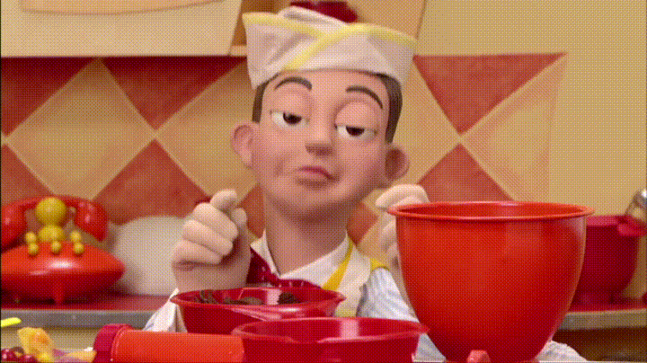

# Lecture 10
## Monads & Symbolic Expressions
### What is monads?
Monads sweeps computational details uner the carpet.

### Haskell is a "pure" language
Same input to functions should always return the same value.

For example, other languages can have additional outputs, for example

```java
int y=0;
int f(int x) {
  y=x+1;
  return 2*x;
}
int g() {
  int z = f(10);
  return y+z;
}
```

They can also change the state and do IO as well as not returning anything, like writing.

### IN haskell all INput And outputs must be visable in the type.

```haskell
Pure function:	Input -> Output
Extra input:	Input -> Extra -> Output
Extra output:	Input -> (Extra,Output)
Changing the state:	Input -> State -> (State,Output)
IO operations:	Input -> IO Output
Sometimes no result:	Input -> Maybe Output
Many results:	Input -> [Output]
```

THis requires more code in haskell than in other languages, like returning an extra output;
```haskell
-- Extra output
h x = (o1<>o2,y2)
 where
   (o1,y1) = f x
   (o2,y2) = g y1

-- Changing the state:
h x s0 = (s2,y2)
 where
    (s1,y1) = f x s0
    (s2,y2) = g y1 s1
```
Another example is combining two functions, g and f, we have to write this in haskell as:
```haskell
h x = (o1<>o2,y2)
  where
    (o1,y1) = f x
    (o2,y2) = g y1
```
This is a bit longer, but if we use the power of higher order functions we can perhaps write this as;
```haskell
h x = g =<< f x
```
and define a function =<< that hides the glue code.

We can write this as:
```haskell
g =<< fx = (o1<>o2,y2)
   where
     (o1,y1) = fx
     (o2,y2) = g y1
```

However, if we want to use this operator on other applications we need to reimplement it for all cases, maybe we can make it a type class and use overloading.

The pattern for a type class can be explained as follows:
```
**Type of effect	   The common pattern	   The difference**
Pure function:	        Input -> M Output     	 M a = a
Extra input:	          Input -> M Output	       M a = Extra -> a
Extra output:	          Input -> M Output	       M a = (Extra,a)
Changing the state:   	Input -> M Output	       M a = State->(State,a)
IO operations:	        Input -> M Output	       M a = IO a
Sometimes no result:	  Input -> M Output	       M a = Maybe a
Many results:	          Input -> M Output	       M a = [a]
```
The difference between this and the types mentioned earlier is that instead of a type (like IO) we have an *M*
This is called a *Monad*

The type definition for =<< becomes.
```haskell
 (=<<) :: (a -> M b) -> M a -> M b
 ```

 The Monad class is as follows;
 ```haskell
 class Monad m where
  return :: a -> m a
  (>>=) :: m a -> (a->m b) -> m b
  -- ...

(=<<) :: Monad m => (a->m b) -> m a -> m b
f=<<x = x>>=f
```
Using the =<< operation the *do* block is translated into a expression, for example;
```haskell
do x <- m1; y <- m2 x; return (x+y)  ⟹
m1 >>= (\x -> do y <- m2 x; return (x+y))  ⟹
m1 >>= (\x -> m2 x >>= (\y -> return (x+y)))
```
We have enountered monads before, for example *IO,Gen&Parser*.

The maybe type is also a Monad as well as the List type.

THere are a few other monad functions we can use to make the code more elegant;
```haskell
Operator  	Function	Argument 	Result
$	           a->b	      a	        b
<$>	         a->b	      m a	     m b
<*>	         m (a->b)  	m a	     m b
=<<	         a->m b 	  m a	     m b
```

# Functors
There is a class that is called functor, this function applies a function on every element on a list. Examples of types in the functor class are: *Functor IO,Functor Gen & Functor Parser*

The applicative class is a subclass of the functor class also applies a function on a type of data, for example all the elements of a list;
```haskell
class Functor f => Applicative f where
  pure :: a -> f a
  (<*>) :: f (a->b) -> f a -> f b
```
These also has the IO gen and parser instances.

Applicative can be used to make expressions more pretty:
```haskell
oneOrMore :: Parser item -> Parser [item]
oneOrMore item = do i <- item
                    is <- zeroOrMore item        
                    return (i:is)
-------------------------------------
oneOrMore item = (:) <$> item <*> zeroOrMore item
```
Note; In GHC 7.10+ the Applicative is a superclass of the Monads class.



